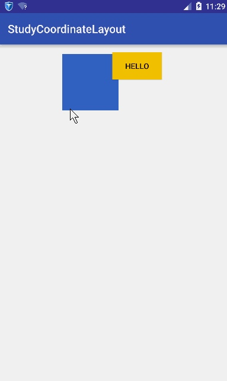

# CoordinatorLayout
> 协调者布局，用于协调子view中的动画。可以配合AppBarLayout,FloatingActionButton等子控件。

---
## 自定义Behavior的使用 
* 实现效果如下（借用网络图片）



* 实现效果描述
    当移动蓝色色块的时候，显示HELLO 的button 一起滑动（滑动方式：当蓝色色块左右滑动时，button水平方向滑动且与蓝色色块滑动方向相反；当蓝色色块上下滑动时，button垂直方向滑动且与蓝色色块滑动方向相同）
    
## 实现原理
使用CoordinatorLayout中的Behavior定制。

> CoordinatorLayout有两个核心概念：Child&Dependency.(Child 就是要执行动作的view，Dependency就是依赖的view) 
> 如上图显示,button就是要执行动作的view，所以button就是child；蓝色色块就是被依赖的view，称为Dependency
> 当Dependency移动时，child做如上描述操作

## 实现步骤
1. 实现可移动的Dependency
    1. 自定义view在onTouchEvent方法中监听滑动，修改当前view的LayoutParams
  
    ```java
    public class MoveView extends View {
    
        private int lastX;
        private int lastY;
    
        public MoveView(Context context) {
            this(context, null);
        }
    
        public MoveView(Context context, @Nullable AttributeSet attrs) {
            this(context, attrs, 0);
        }
    
        public MoveView(Context context, @Nullable AttributeSet attrs, int defStyleAttr) {
            super(context, attrs, defStyleAttr);
        }
    
        @Override
        public boolean onTouchEvent(MotionEvent event) {
            int x = (int) event.getRawX();
            int y = (int) event.getRawY();
            switch (event.getAction()) {
                case MotionEvent.ACTION_DOWN:
                    break;
                case MotionEvent.ACTION_MOVE:
                    CoordinatorLayout.LayoutParams lp = (CoordinatorLayout.LayoutParams) getLayoutParams();
                    lp.leftMargin = lp.leftMargin + x - lastX;
                    lp.topMargin = lp.topMargin + y - lastY;
                    requestLayout();
                    break;
            }
            lastX = x;
            lastY = y;
            return true;
        }
    }
    ```

2. 自定义Behavior
    1. `layoutDependsOn`方法，返回boolean。表示Child是否依赖Dependency
    2. `onDependentViewChanged`方法。表示当Dependency变化时，所需要执行的方法

    
    ```java
      @Override
        public boolean layoutDependsOn(CoordinatorLayout parent, Button child, View dependency) {
            return dependency instanceof MoveView;
        }
    
        @Override
        public boolean onDependentViewChanged(CoordinatorLayout parent, Button child, View dependency) {
            int top = dependency.getTop();
            int left = dependency.getLeft();
    
            int x = parent.getMeasuredWidth() - left - child.getWidth();
            int y = top;
    
            setChildPostion(child,x,y);
            return super.onDependentViewChanged(parent, child, dependency);
        }
    
        private void setChildPostion(View child, int x, int y) {
            CoordinatorLayout.LayoutParams lp = (CoordinatorLayout.LayoutParams) child.getLayoutParams();
            lp.leftMargin = x;
            lp.topMargin = y;
        }
    ```

    ***
    > 注意：前方高能；最核心方法必须要写有Context和AttributeSets的构造方法。
    
    ***
    
    ```java
    public MoveBehavior(Context context, AttributeSet attrs) {
            super(context, attrs);
    
        }
    ```

3. 布局使用Behavior

    ```java
    <?xml version="1.0" encoding="utf-8"?>
<android.support.design.widget.CoordinatorLayout xmlns:android="http://schemas.android.com/apk/res/android"
    xmlns:tools="http://schemas.android.com/tools"
    android:layout_width="match_parent"
    android:layout_height="match_parent"
    xmlns:app="http://schemas.android.com/apk/res-auto"
    tools:context="com.example.wangx.coordinatorlayoutstudy.MainActivity">

    <com.example.wangx.coordinatorlayoutstudy.MoveView
        android:layout_width="150dp"
        android:layout_height="80dp"
        android:layout_marginLeft="200dp"
        android:layout_marginTop="100dp"
        android:background="#3366cc" />

    <Button
        app:layout_behavior="com.example.wangx.coordinatorlayoutstudy.MoveBehavior"
        android:layout_width="wrap_content"
        android:text="Hello Child"
        android:background="#ffff00"
        android:layout_marginLeft="30dp"
        android:layout_marginTop="100dp"
        android:layout_height="wrap_content" />
</android.support.design.widget.CoordinatorLayout>

    ```


